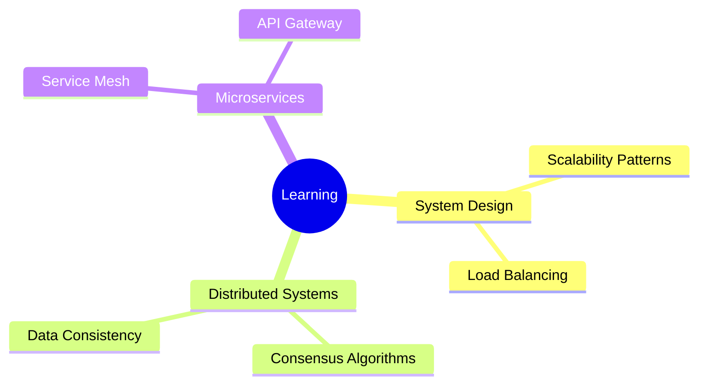

<div align="center">

# 👋 Hey there, I'm Parvez Khan

### 🚀 Full-Stack Developer | Software Engineer | Backend Architect


[](https://www.linkedin.com/in/parvez-khan/)
[](https://leetcode.com/parvezkhan)
[](https://medium.com/@parvez0khan)

</div>

---

## 🛠️ Tech Arsenal

<table>
<tr>
<td valign="top" width="50%">

### 🎨 Frontend


### ⚙️ Backend


</td>
<td valign="top" width="50%">

### 🗄️ Databases


### ☁️ Cloud & DevOps


</td>
</tr>
</table>

---

## 💼 Professional Journey

<details open>
<summary><b>🔧 Backend Engineer @ Wingify</b></summary>
<br>

```python
achievements = {
    "api_development": "Engineered RESTful APIs with Python",
    "optimization": "Optimized query performance & robust error handling",
    "security": "Implemented JWT authentication systems",
    "deployment": "Containerized services with Docker for scalability"
}
```

</details>

<details>
<summary><b>🎨 Frontend Developer @ Tessact</b></summary>
<br>

```typescript
const impact = {
  components: "Built reusable TypeScript/React components",
  consistency: "Improved code quality across applications",
  database: "Designed MongoDB schemas for microservices",
  performance: "Optimized database queries"
};
```

</details>

---

## 🎯 Featured Projects

<div align="center">

| Project | Description | Tech Stack |
|---------|-------------|------------|
| 🛒 **[Price-Mate](https://github.com/Parvezkhan0/Price-Mate)** | E-commerce price tracker with automated alerts | Next.js, Web Scraping |
| 📝 **[LiveDocs](https://github.com/Parvezkhan0/LiveDocs)** | Real-time collaborative document editor | Next.js, TypeScript, Liveblocks |
| 📈 **[Tesla Stock Forecasting](https://github.com/Parvezkhan0/Tesla-Stock-Forecasting-Using-LTSM)** | LSTM-based stock prediction system | Python, LSTM, ML |
| 🎯 **[Customer Segmentation](https://github.com/Parvezkhan0/Customer-Segmentation-for-E-commerce)** | ML-powered analytics platform | K-Means, Classification Models |

</div>

---

## 🏆 Achievements & Stats

<div align="center">

### 🎖️ Coding Milestones

| Platform | Achievement | Details |
|----------|-------------|---------|
| 💻 **LeetCode** | Global Rank **#1467** | 800+ problems solved |
| 🌟 **GeeksforGeeks** | Active Contributor | 160+ problems, 1 article |
| 🥈 **CodeGen Competition** | 2nd Place Winner | Competitive Programming |

</div>

---

## 📊 GitHub Analytics

<div align="center">


</div>

---

## 🌱 Current Focus

<div align="center">



</div>

---

<div align="center">

### 💡 Open to Collaboration

**Interested in working on innovative projects and contributing to impactful open-source initiatives**

[](https://github.com/Parvezkhan0)

---


</div>
